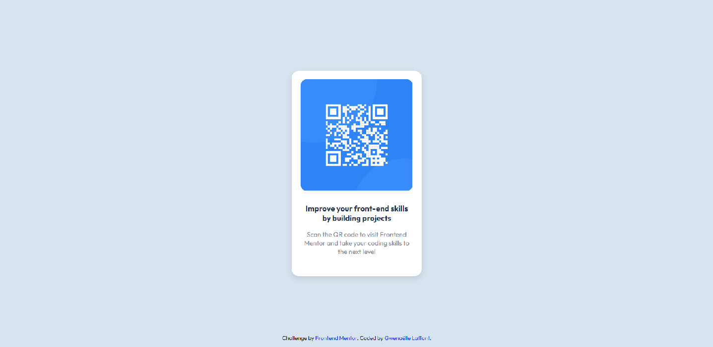

# Frontend Mentor - QR code component solution

This is a solution to the [QR code component challenge on Frontend Mentor](https://www.frontendmentor.io/challenges/qr-code-component-iux_sIO_H). Frontend Mentor challenges help you improve your coding skills by building realistic projects. 

## Table of contents

- [Overview](#overview)
  - [Screenshot](#screenshot)
  - [Links](#links)
- [My process](#my-process)
  - [Built with](#built-with)
  - [What I learned](#what-i-learned)
  - [Continued development](#continued-development)
- [Acknowledgments](#acknowledgments)

## Overview

### Screenshot

Mobile version and Desktop version essentially use the same code.

### Links

- Solution URL: (https://github.com/Pandacea12/GitHub-Challenges/tree/main/qr-code-challenge)

## My process

### Built with

- Semantic HTML5 markup
- CSS custom properties
- Flexbox

### What I learned

I have spent more time than I should wondering why the border radius on top of the QR picture was different from the bottom one, until I finally realized that it was an issue with the padding setting.

### Continued development

I want to keep focusing on learning flexbox and flex grid in the future, seeing as those two are my weakest areas when it comes to web page styling.

## Acknowledgments

Frontend Mentor provided very clear instructions that kept me from struggling too much.

